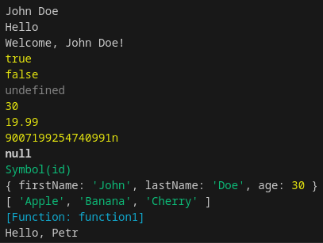

# Cheatsheet

1. [Začátečnická úroveň (Beginner Level)](#začátečnická-úroveň-beginner-level)
   - [Datové typy (Data Types)](#datové-typy-data-types)
   - [Proměnné (Variables)](#proměnné-variables)

## Začátečnická úroveň (Beginner Level)

### Datové typy (Data Types)

```javascript
// Primitivní typy (Primitive Types)

// String (Řetězec)
let string1 = "John Doe";                   // John Doe
let string2 = 'Hello';                      // Hello
let string3 = `Welcome, ${string1}!`;       // Welcome, John Doe!

// Number (Číslo)
let num1 = 30;                              // 30 (celé číslo)
let num2 = 19.99;                           // 19.99 (desetinné číslo)
let num3 = 2.998e8;                         // 299800000 (vědecká notace)

// Boolean (Logická hodnota)
let bool1 = true;                           // true
let bool2 = false;                          // false

// Undefined (Nedefinováno)
let undefined1;                             // undefined

// Null (Prázdná hodnota)
let null1 = null;                           // null

// Symbol (Unikátní identifikátor)
let symbol1 = Symbol('id');                 // Symbol(id)

// BigInt (Velké celé číslo)
let bigInt1 = BigInt(9007199254740991);     // 9007199254740991n 
let bigInt2 = 1234567890123456789012345678901234567890n; // Přímý zápis BigInt

// Objektové typy (Object Types)

// Object (Objekt)
let obj1 = {                                
    firstName: "John",                      
    lastName: "Doe",                        
    age: 30,
    greet: function() {
        return `Hello, ${this.firstName}!`;
    }
};
console.log(obj1);                          // { firstName: 'John', lastName: 'Doe', age: 30, greet: [Function: greet] }
console.log(obj1.greet());                  // Hello, John!

// Array (Pole)
let array1 = ["Apple", "Banana", "Cherry"]; // [ 'Apple', 'Banana', 'Cherry' ] 

// Function (Funkce)
function fnc1(name) {                       
    return "Hello, " + name;
}
console.log(fnc1);                          // [Function: fnc1] 
console.log(fnc1("Petr"));                  // Hello, Petr 

// Date (Datum)
let date1 = new Date();                     // Current date and time
console.log(date1);                         // e.g., 2023-07-30T12:34:56.789Z

// RegExp (Regulární výraz)
let regex1 = /^[a-zA-Z0-9._%+-]+@[a-zA-Z0-9.-]+\.[a-zA-Z]{2,}$/;
console.log(regex1);                        // /^[a-zA-Z0-9._%+-]+@[a-zA-Z0-9.-]+\.[a-zA-Z]{2,}$/

// Map (Mapa)
let map1 = new Map();
map1.set("key1", "value1");
console.log(map1);                          // Map(1) { 'key1' => 'value1' }

// Set (Množina)
let set1 = new Set([1, 2, 3, 3, 4]);
console.log(set1);                          // Set(4) { 1, 2, 3, 4 }

// Zjištění typu
console.log(typeof string1);                // "string"
console.log(typeof num1);                   // "number"
console.log(typeof bool1);                  // "boolean"
console.log(typeof undefined1);             // "undefined"
console.log(typeof null1);                  // "object" (historická chyba v JS)
console.log(typeof symbol1);                // "symbol"
console.log(typeof bigInt1);                // "bigint"
console.log(typeof obj1);                   // "object"
console.log(typeof array1);                 // "object"
console.log(typeof fnc1);                   // "function"
console.log(Array.isArray(array1));         // true (specifická kontrola pro pole)
```



[**ReferenceBook - Data Types**](README.md#datové-typy-data-types)

