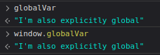

# Cheatsheet

1. [Začátečnická úroveň (Beginner Level)](#začátečnická-úroveň-beginner-level)
   - [Datové typy (Data Types)](#datové-typy-data-types)
   - [Proměnné (Variables)](#proměnné-variables)
   - [Operátory (Operators)](#operátory-operators) 

## Začátečnická úroveň (Beginner Level)

### Datové typy (Data Types)

```javascript
// Primitivní typy (Primitive Types)

// String (Řetězec)
let string1 = "John Doe";                   // John Doe
let string2 = 'Hello';                      // Hello
let string3 = `Welcome, ${string1}!`;       // Welcome, John Doe!

// Number (Číslo)
let num1 = 30;                              // 30 (celé číslo)
let num2 = 19.99;                           // 19.99 (desetinné číslo)
let num3 = 2.998e8;                         // 299800000 (vědecká notace)

// Boolean (Logická hodnota)
let bool1 = true;                           // true
let bool2 = false;                          // false

// Undefined (Nedefinováno)
let undefined1;                             // undefined

// Null (Prázdná hodnota)
let null1 = null;                           // null

// Symbol (Unikátní identifikátor)
let symbol1 = Symbol('id');                 // Symbol(id)

// BigInt (Velké celé číslo)
let bigInt1 = BigInt(9007199254740991);     // 9007199254740991n 
let bigInt2 = 1234567890123456789012345678901234567890n; // Přímý zápis BigInt

// Objektové typy (Object Types)

// Object (Objekt)
let obj1 = {                                
    firstName: "John",                      
    lastName: "Doe",                        
    age: 30,
    greet: function() {
        return `Hello, ${this.firstName}!`;
    }
};
console.log(obj1);                          // { firstName: 'John', lastName: 'Doe', age: 30, greet: [Function: greet] }
console.log(obj1.greet());                  // Hello, John!

// Array (Pole)
let array1 = ["Apple", "Banana", "Cherry"]; // [ 'Apple', 'Banana', 'Cherry' ] 

// Function (Funkce)
function fnc1(name) {                       
    return "Hello, " + name;
}
console.log(fnc1);                          // [Function: fnc1] 
console.log(fnc1("Petr"));                  // Hello, Petr 

// Date (Datum)
let date1 = new Date();                     // Current date and time
console.log(date1);                         // e.g., 2023-07-30T12:34:56.789Z

// RegExp (Regulární výraz)
let regex1 = /^[a-zA-Z0-9._%+-]+@[a-zA-Z0-9.-]+\.[a-zA-Z]{2,}$/;
console.log(regex1);                        // /^[a-zA-Z0-9._%+-]+@[a-zA-Z0-9.-]+\.[a-zA-Z]{2,}$/

// Map (Mapa)
let map1 = new Map();
map1.set("key1", "value1");
console.log(map1);                          // Map(1) { 'key1' => 'value1' }

// Set (Množina)
let set1 = new Set([1, 2, 3, 3, 4]);
console.log(set1);                          // Set(4) { 1, 2, 3, 4 }

// Zjištění typu
console.log(typeof string1);                // "string"
console.log(typeof num1);                   // "number"
console.log(typeof bool1);                  // "boolean"
console.log(typeof undefined1);             // "undefined"
console.log(typeof null1);                  // "object" (historická chyba v JS)
console.log(typeof symbol1);                // "symbol"
console.log(typeof bigInt1);                // "bigint"
console.log(typeof obj1);                   // "object"
console.log(typeof array1);                 // "object"
console.log(typeof fnc1);                   // "function"
console.log(Array.isArray(array1));         // true (specifická kontrola pro pole)
```


[**ReferenceBook - Data Types**](README.md#datové-typy-data-types)

### Proměnné (Variables)

```javascript
// --- Přeřazování proměnných ---

var oldVar = "I'm old-fashioned";
oldVar = "I'm old"      //OK
let age = 30;
age = 31;               // OK
const PI = 3.14159;
PI = 3;                 // Error

// --- Rozsah `var` vs `let` ---

function varScope() {
  var x = 1;
  if (true) {
    var x = 2;          // Stejná proměnná!
    console.log(x);     // 2
  }
  console.log(x);       // 2
}

function blockScope() {
  let x = 1;
  if (true) {
    let x = 2;          // Různé proměnné
    console.log(x);     // 2
  }
  console.log(x);       // 1
}

function blockScope2() {
  let x = 1;
  if (true) {
    let y = 2;  
    console.log(x, y);  // 1 2
  }
  console.log(x, y);    // ReferenceError: y is not defined
}

// --- Vyzdvižení proměnných (Hoisting), TDZ (Temporal Dead Zone) ---

console.log(a);  // undefined
var a = 5;
console.log(b);  // ReferenceError
let b = 5;
console.log(c);  // ReferenceError
const c = 5;

// --- Deklarace a mutace objektů ---

const person = {
  name: "John Doe",
  age: 30
};

person.age = 31;            // OK
console.log(person.age);    // 31

person = { name: "Jane Doe", age: 25 };  // Error

const numbers = [1, 2, 3];
numbers.push(4);            // OK
numbers[0] = 2;             // OK
console.log(numbers);       // [2, 2, 3, 4]

numbers = [5, 6, 7];        // TypeError: Assignment to constant variable.

// --- Globální proměnné ---

// implicitní
function createGlobal() {
  globalVar = "I'm global"; // vytvoří globální proměnnou
}
createGlobal();
console.log(globalVar);     // "I'm global"

// explicitní
var globalVar = "I'm explicitly global";
window.globalVar = "I'm also explicitly global";  // In browser environment
```




[**ReferenceBook - Variables**](README.md#proměnné-variables)


### Operátory (Operators)

```javascript
// Basic Arithmetic Operators
5 + 3;                    // 8            | Addition (+)
10 - 4;                   // 6            | Subtraction (-)
4 * 2;                    // 8            | Multiplication (*)
20 / 5;                   // 4            | Division (/)
17 % 5;                   // 2            | Modulo (%)

// Assignment Operators
x = 10;                   // 10           | Assignment (=)
x += 3;                   // 13           | Addition assignment (+=)
x -= 2;                   // 11           | Subtraction assignment (-=)
x *= 2;                   // 22           | Multiplication assignment (*=)
x /= 2;                   // 11           | Division assignment (/=)

// Comparison Operators
5 == "5";                 // true         | Equality (==)
5 === "5";                // false        | Strict equality (===)
5 != "6";                 // true         | Inequality (!=)
5 !== "5";                // true         | Strict inequality (!==)
10 > 5;                   // true         | Greater than (>)
3 < 7;                    // true         | Less than (<)
5 >= 5;                   // true         | Greater than or equal to (>=)
4 <= 4;                   // true         | Less than or equal to (<=)

// Logical Operators
true && true;             // true         | Logical AND (&&)
false || true;            // true         | Logical OR (||)
!true;                    // false        | Logical NOT (!)

// Unary Operators
let y = 5;
++y;                      // 6            | Increment (++)
--y;                      // 5            | Decrement (--)
+"3";                     // 3            | Unary plus (+)
-5;                       // -5           | Unary minus (-)

// Bitwise Operators
5 & 3;                    // 1            | Bitwise AND (&)
5 | 3;                    // 7            | Bitwise OR (|)
5 ^ 3;                    // 6            | Bitwise XOR (^)
~5;                       // -6           | Bitwise NOT (~)
5 << 1;                   // 10           | Left shift (<<)
5 >> 1;                   // 2            | Sign-propagating right shift (>>)
-5 >>> 1;                 // 2147483645   | Zero-fill right shift (>>>)

// Ternary Operator
let age = 20;
age >= 18 ? "Adult" : "Minor"; // "Adult"     | Ternary (condition ? expr1 : expr2)

// Optional Chaining Operator
let obj = {prop: {method: () => "Hello"}};
obj?.prop?.method?.();    // "Hello"      | Optional chaining (?.)

// Nullish Coalescing Operator
null ?? "default";        // "default"    | Nullish coalescing (??)

// typeof Operator
typeof 42;                // "number"     | typeof

// Spread Operator
let arr = [1, 2, 3];
console.log(...arr);      // 1 2 3        | Spread (...)

// in Operator
'name' in {name: 'John'}; // true         | in

// instanceof Operator
[] instanceof Array;      // true         | instanceof

// delete Operator
let obj2 = {x: 1, y: 2};
delete obj2.x;            // true         | delete

// new Operator
new Date();               // [Date object]| new

// void Operator
void 0;                   // undefined    | void

// yield Operator (inside generator function)
function* gen() { yield 1; }
gen().next().value;       // 1            | yield

// await Operator (inside async function)
async function fetchData() {
  let response = await fetch('https://api.example.com/data');
  // [Response object] | await
}
```

[**ReferenceBook - Operators**](README.md#operátory-operators)